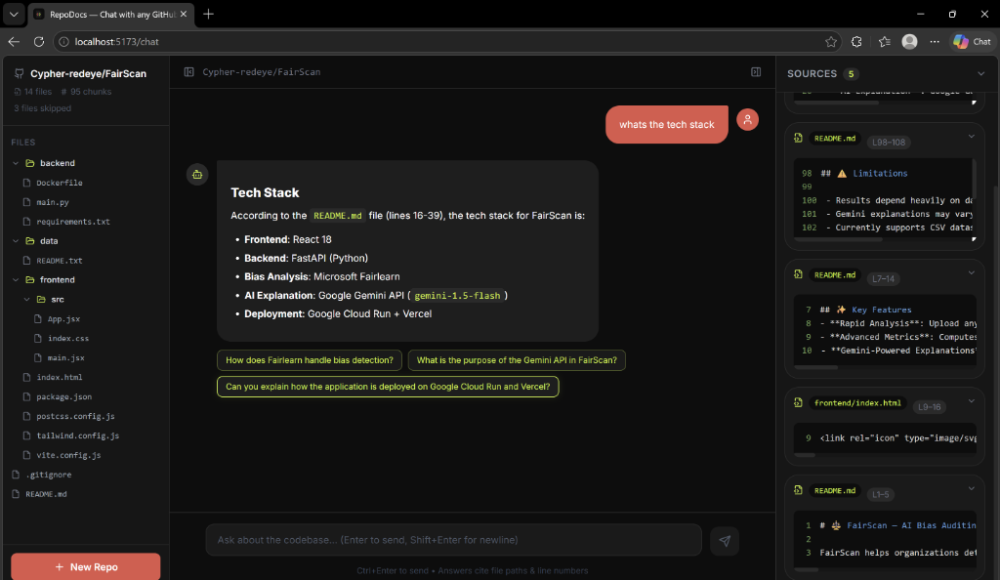
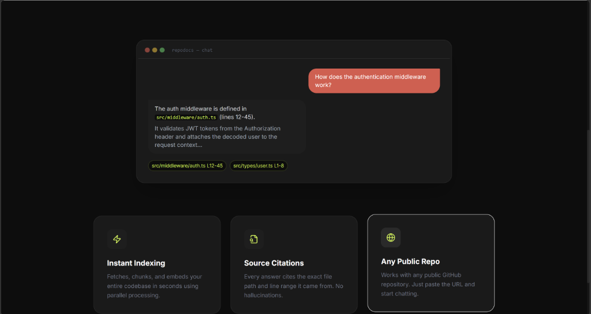
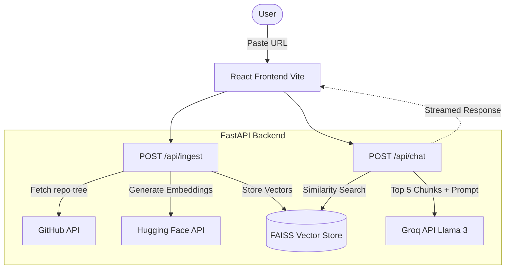
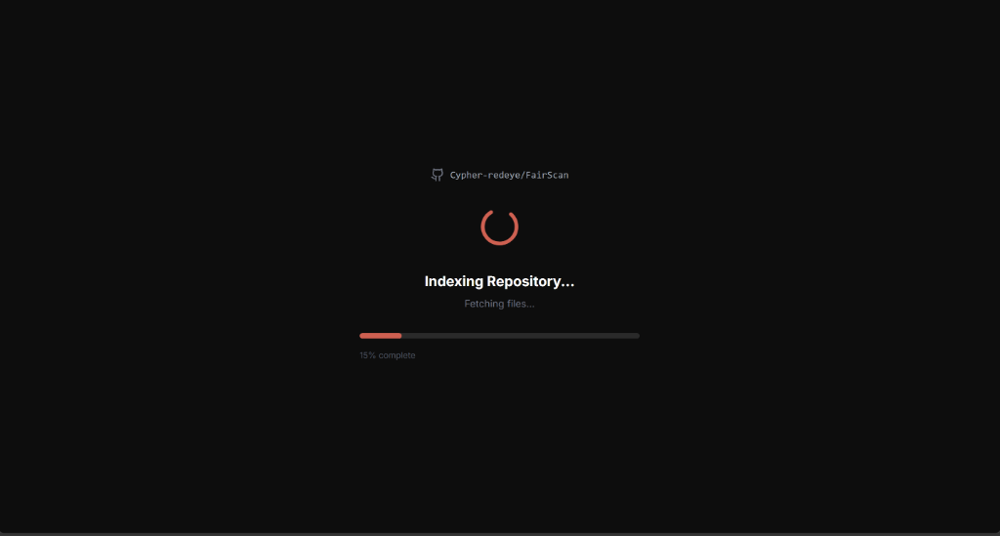
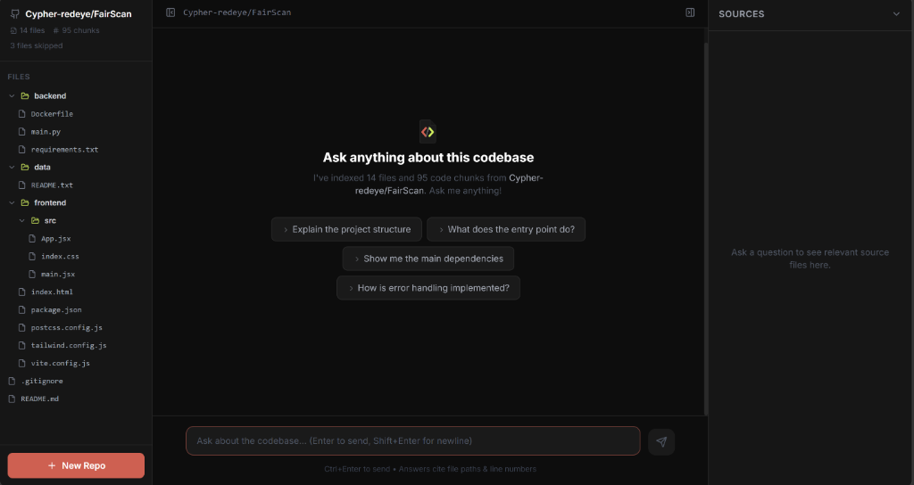
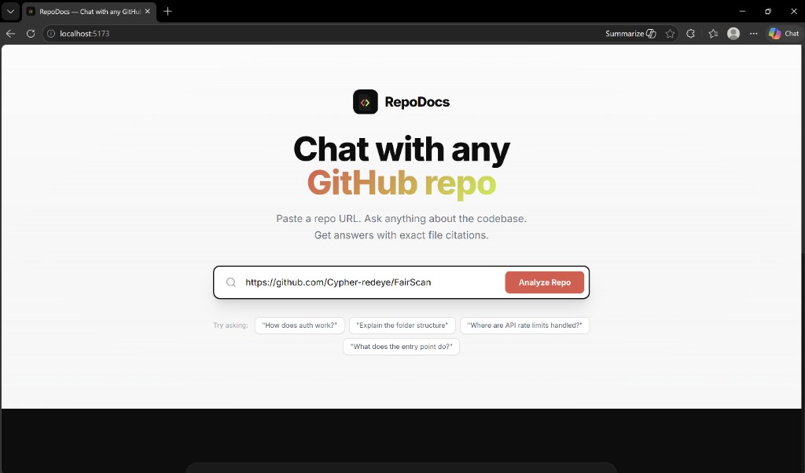

# ⚡ RepoDocs

> Chat with any GitHub repository using AI. Paste a URL, ask questions, and get precise answers with exact file and line citations.



---

## 📖 What is RepoDocs?

RepoDocs is a lightning-fast, highly accurate RAG-powered codebase assistant. You paste a public GitHub repo URL — it indexes the entire codebase, embeds it into a local vector store, and lets you chat with it naturally without hallucinations.

Ask things like:
- *"How does the authentication middleware work?"*
- *"Where are API rate limits handled?"*
- *"Explain the folder structure"*
- *"What does the main entry point do?"*

**Every single answer cites the exact file path and line numbers it pulled from.**

---

## 🛠️ Tech Stack

RepoDocs is built entirely on a modern, lightweight open-source stack, avoiding expensive closed-source APIs where possible.

| Layer | Technology |
|---|---|
| **Frontend** | React 18 · Vite · Tailwind CSS |
| **Backend** | Python · FastAPI |
| **RAG Pipeline** | LangChain · FAISS (Local Vector Database) |
| **Embeddings** | Hugging Face Inference API (`sentence-transformers/all-MiniLM-L6-v2`) |
| **LLM Inference** | Groq (`llama-3.1-8b-instant`) |
| **Ingestion** | GitHub REST API |

---

## ✨ Features



- **⚡ Instant Indexing** — Fetches and embeds any public repo in seconds using parallel processing.
- **🎯 Source Citations** — Every answer cites the exact file path and line range it came from. No hallucinations.
- **🌊 Streaming Responses** — Answers stream in real-time via Server-Sent Events (SSE).
- **🗂️ File Tree Sidebar** — Browse all indexed files within the chat interface.
- **💡 Follow-up Chips** — Suggested contextual questions after each answer to keep the exploration going.
- **🔒 Session Isolation** — Each repo gets its own local FAISS index, cleaned up entirely on demand.

---

## 🏗️ Architecture



---

## 📸 Screenshots

| Indexing Repository | Chat Interface |
|:---:|:---:|
|  |  |
|  | |

---

## 🚀 Getting Started

### Prerequisites
- Python 3.11+
- Node.js 18+
- Groq API Key
- Hugging Face Access Token (Make sure the token has "Inference" permissions enabled)

### 1. Local Setup

**Clone the repo**
```bash
git clone https://github.com/Cypher-redeye/RepoDocs.git
cd RepoDocs
```

**Backend Configuration**
```bash
cd backend
python -m venv venv
source venv/bin/activate        # Windows: venv\Scripts\activate
pip install -r requirements.txt
```

**Set Environment Variables**
```bash
cp .env.example .env
```
Add your API keys to the `.env` file in the root directory:
```env
GROQ_API_KEY=gsk_...
HF_TOKEN=hf_...
GITHUB_TOKEN=ghp_...           # Optional: increases GitHub API rate limit from 60 to 5000/hr
MAX_FILES=500                  # Max files to index per repo
```

**Run the backend**
```bash
uvicorn main:app --reload --port 8000
```

**Frontend Configuration**
```bash
cd ../frontend
npm install
npm run dev
```

App runs at `http://localhost:5173`

---

### 2. Docker Setup (Recommended)

You can easily run the entire stack with a single command using Docker. This setup automatically maps a persistent volume for the FAISS database.

```bash
docker compose up --build -d
```

- Frontend → `http://localhost:3000`  
- Backend → `http://localhost:8000`

---

## 📚 API Reference

### `POST /api/ingest`
Fetch, chunk, and embed a GitHub repository.

```bash
curl -X POST http://localhost:8000/api/ingest \
  -H "Content-Type: application/json" \
  -d '{"repo_url": "https://github.com/tiangolo/fastapi"}'
```

### `GET /api/status/{session_id}`
Check ingestion progress in real-time.

### `POST /api/chat`
Ask a question about the indexed codebase. Streams an SSE response containing source chunks, streaming tokens, and follow-up suggestions.

### `DELETE /api/session/{session_id}`
Clean up a session and permanently delete its vector store from disk.

---

## ⚠️ Limitations

- **Public repos only** — private repos require a GitHub token with appropriate repository scopes.
- **500 file limit** — to respect API limits, repos larger than 500 files are currently truncated.
- **Stateless Cloud Deployments** — if deployed to free serverless platforms (like Render's free tier), the local FAISS index will be wiped upon server spin-down unless a persistent disk is attached.

---

## 👨‍💻 Built By

**Om** — [GitHub](https://github.com/Cypher-redeye) · [LinkedIn](https://www.linkedin.com/in/om-sharma38/)

Part of a series of AI-powered developer tools. Also check out [FairScan](https://github.com/Cypher-redeye/FairScan) — an AI Bias Auditing Tool.

---

## 📄 License

MIT License — see [LICENSE](./LICENSE) for details.
